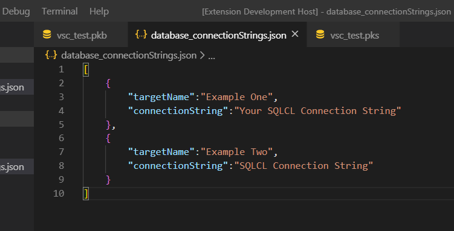

# VSQL-Developer
An Visual Studio Code Extension for compiling (PL)SQL code with SQLcl inside VScode

## Getting Started
There are three ways to get this extension running.  
1. The easiest way is to just install it from the [visual studio code marketplace]().  
2. You can also download an installable [file]().  
3. If you want to adjust or expand the extension yourself you can follow the [installing](#Installing) instructions .

No matter which way you choose, after you have installed the extension you have to do a quick [setup](#Setup).

### Prerequisites

**Needed:**  
..* **Visual Studio Code** (this extension was developed with version 1.40.1)
..* **SQLcl** which is used to compile the code

Get VsCode [here](https://code.visualstudio.com/)   
Get SQLcl [here](https://www.oracle.com/de/database/technologies/appdev/sqlcl.html)

**Recommended:**  
..* [Language PL/SQL](https://marketplace.visualstudio.com/items?itemName=xyz.plsql-language)  
..* [Bracket Pair Colorizer 2](https://marketplace.visualstudio.com/items?itemName=CoenraadS.bracket-pair-colorizer-2)  
..* [Material Icon Theme](https://marketplace.visualstudio.com/items?itemName=PKief.material-icon-theme)


### Installing


### Setup
After you have successfully installed the extension you need to follow some setup steps to get it working

At first you need to add the path of your your sqlcl installation

```
To do so press 'ctrl + shift + p', type in "settings" and choose "Preferences: Open Settings(UI)".
```

```
Then search for "vsql-deveolper" and add the Path to your SQLcl installation.
```

Note: It may only work after you have restartet Visual Studio code.


The second step is to add you personal database connection strings
```
For this you have to create a file named "database_connectionStrings.json" in  
the root folder of your project.
Now you can add somme connections like shown in the image below.
```


Note: Just safe the file. The extension will automatically recognize it.

Now you are ready to use vsql-developer

```
For this just click on the file containing the (PL)SQL code that you want to execute.
Then press 'ctrl + shift + p' and choose "Compile PLSQL".
```
Feel free to [add a key](https://code.visualstudio.com/docs/getstarted/keybindings) to the "Compile PLSQL"-command.

## Running the tests


## Authors

* **Sebastian Koell** - *Project Owner and Idea* -
* **fd-primus** - *Development* - 


## Acknowledgments
### Thanks to
*  Morten Braten whose [guide](https://ora-00001.blogspot.com/2017/03/using-vs-code-for-plsql-development.html) and error file I used
*  Trent Schafer [odb-task extension](https://marketplace.visualstudio.com/items?itemName=tschf.odb-task) for some inspiration
*  PurpleBooth for the [readme template](https://gist.github.com/PurpleBooth/b24679402957c63ec426)
